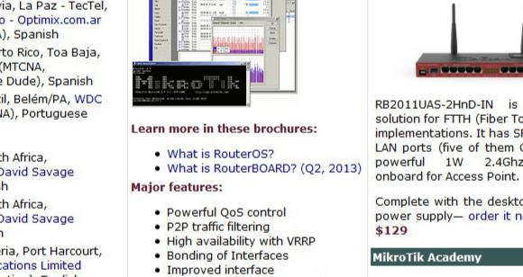
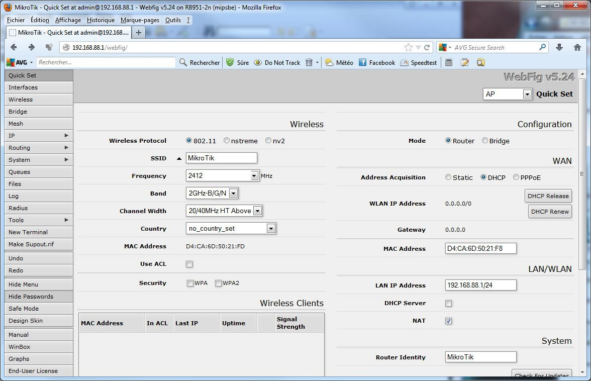
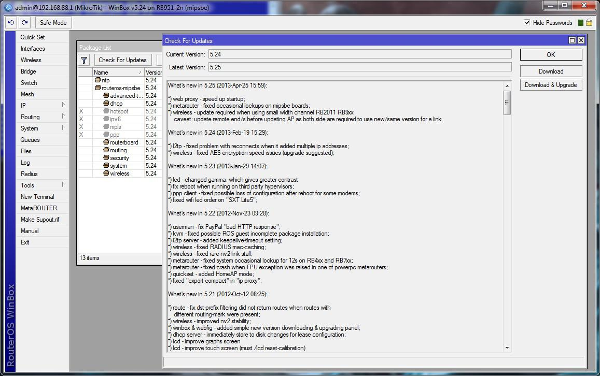
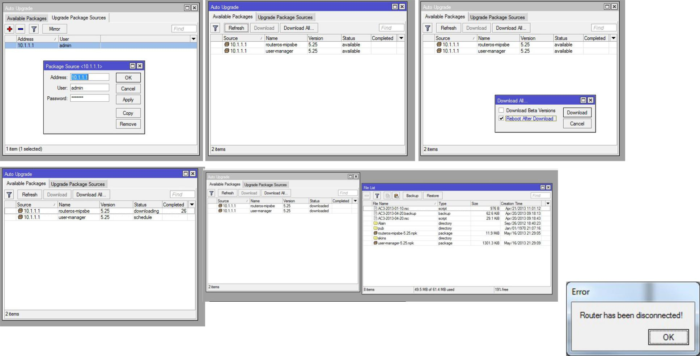
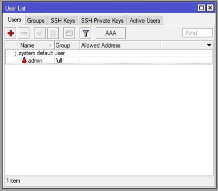
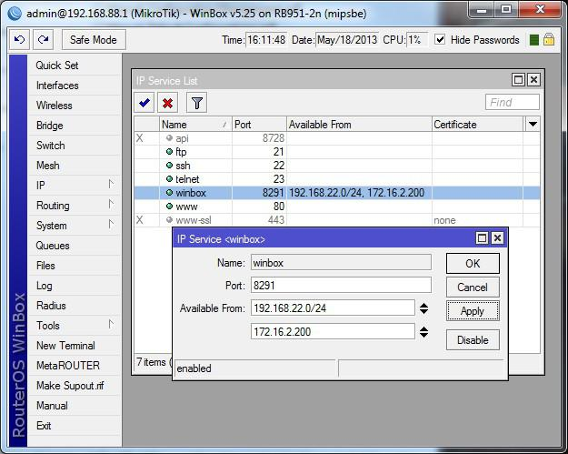
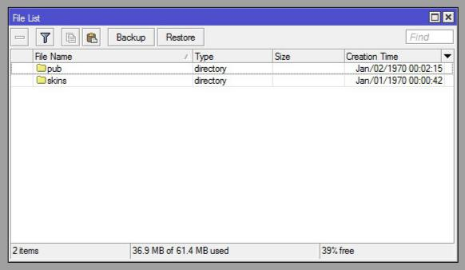
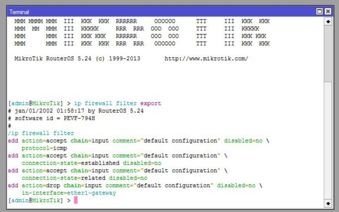
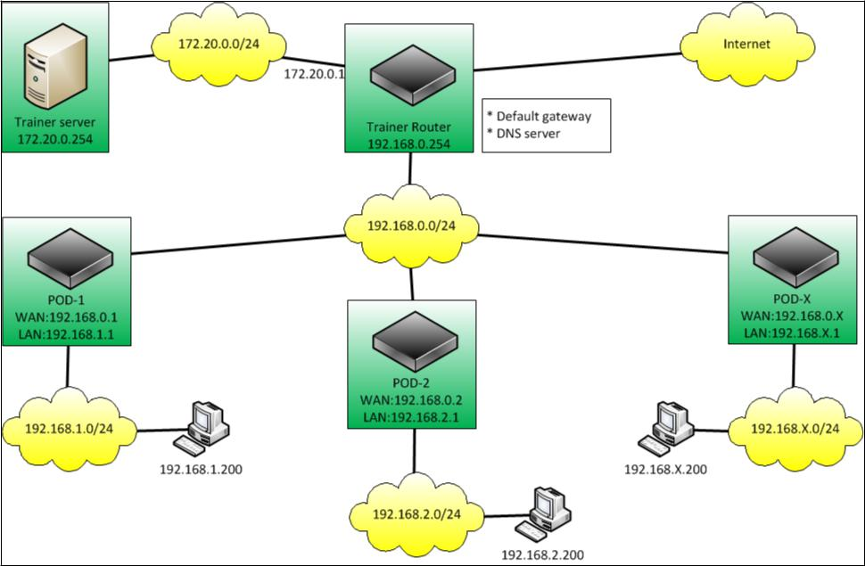

# M1 Intro

## **Для чего нужен курс MTCNA?**

* Знакомство с RouterOS и продуктами RouterBoard.
* Вы получите представление, что можно сделать с помощью RouterOS и продуктов RouterBOARD
* Всё это даст Вам прочную базу и важные знания, которые помогут Вам в работе.

## Цели данного курса:

После изучения курса Вы:

* Будете знакомы с возможностями RouterOS и RouterBoard
* Сможете настраивать, управлять, проводить основную отладку роутеров MikroTik
* Сможете предоставлять основные сервисы клиентам

## Введение

### **Модуль 1**

#### **RouterOS и RouterBoard**

Что такое RouterOS?

* MikroTik RouterOS - это операционная система, на которой работают все продукты MikroTik RouterBOARD.
* Содержит все необходимые возможности для провайдеров и сетевых администраторов: роутинг, фаервол, контроль скорости доступа, резервирование канала, точка доступа, хотспот, VPN сервер и другие.
* RouterOS - операционная система с простым и удобым интерфейсом. Она основана на ядре Linux и её установка не составит сложностей и не займёт много времени.

Что такое RouterBOARD?

* Семейство оборудования, созданное MikroTik. Оно покрывает нужды пользователей по всему миру.
* Все RouterBOARDы работают на RouterOS.

routerboard.com

### Готовые решения

* Это оборудование поставляется в собранном виде, в корпусе и с блоком питания
* Готово к использованию и преднастроенно для большинства конфигураций
* Всё, что нужно сделать - включить его в розетку и подключить к интернету или корпроративной сети.

#### RouterBOARD \(только платы\)

* Небольшие материнские платы, которые продаются "как есть". Вам нужно покупать для них корпус, блок питания и интерфейсы по отдельности. Подходят для сбора индивидуальной конфигурации, т.к. предлагается огромное количество вариантов кастомизации.

#### Корпуса

* Внутренние и внешние корпуса для Ваших RouterBOARDs.

Выбирайте, исходя из:

* места размещения роутера
* модели RouterBOARD
* типов подключения \(USB, антенны и т.д.\).

#### Интерфейсы

* Модули Ethernet, SFP или беспроводные интерфейсы, чтобы расширить функционал RouterBOARD и компьютеров с RouterOS.
* Опять же, выбирайте, отталкиваясь от Ваших нужд и задач.

#### Аксессуары

* Продукты, которые сделаны для MikroTik - блоки питания, крепежи, антенны и PoE инжекторы.

#### MFM

* С программой MFM \(Made for Mikrotik\), сторонние организации предоставляют возможности улучшить Ваш роутер

Почему готовые решения?

* Подходят под большинство запросов
* Некоторые возможности расширения
* Фиксированная конфигурация
* Простое, но надёжное решение для многих задач.

#### Готовые решения. Примеры:

**RB951G-2HnD**

\*\*\*\*\*\*\*\*

* Подходит для дома и малого офиса
* 5 Gig ports
* Встроенный Wi-Fi \(2,4GHz\)
* Лицензия: level 4

**SXT Sixpack**

\(1 OmniTIK U-5HnD with 5 SXT-5HPnD\)

* Good for WISP or company with branch offices
* 5 100Mbps ports \(OmniTik\)
* 5GHz 802.11a/n radios
* Can cover 5Km between central and satellite sites

**CCR1036-12G-4S Cloud Router**

_**Флагманская модель**_

* Роутер для провайдеров или корпоративных сетей
* Rack mount корпус высотой в 1 юнит
* 12 Gig портов
* Serial console, USB и цветной сенсорный экран
* Изначально 4G RAM, расширяется с помощью модулей SO-DIMM RAM

На заметку:

* Название соответствует возможностям роутера. Примеры:
  * CCR : Cloud Core Router
  * RB : RouterBoard
  * 2, 5 : 2,4GHZ or 5GHz wifi radio
  * H : High powered radio
  * S : SFP
  * U : USB
  * i : Injector
  * G : Gigabit ethernet

Зачем создавать свой собственный маршрутизатор?

* Сможете адресовать большое разнообразие потребностей
* Множество дополнительных опций/расширений
* Настраиваемая конфигурация
* Может быть встроено в оборудование или шкаф клиента
* Более полное решение для конкретных потребностей

Собственный роутер. Пример:

#### **Гибкое CPE**

* **RB411UAHR**
  * – 1 порт 100Mbps
  * – 1 2,4GHz radio \(b/g\)
  * – Лицензия Level 4
* Добавим блок питания
* Добавим корпус 3rd ****party
* Добавим miniPCIe-3g-модем

#### **Мощный хотспот**

* **RB493G**
  * 9 gig портов
  * лицензия Level 5
* Add power supply or PoE module
* Add R2SHPn \(2,4GHz radio card\)
* Add R5SHPn \(5GHz radio card\)
* Add 3rd party enclosure
* Add microSD card

## **Первоначальный доступ на роутер**

### Через интернет-браузер

* "Интуитивно понятный" способ доступа к роутеру

Доступ через интернет-браузер

* Подключитесь к роутеру патчкордом
* Запустите браузер
* Введите IP-адрес роутера
* Если потребуется, введите данные для входа. По умолчанию пользователь "admin", пароля нет

Доступ через интернет-браузер

* Вы увидите:

### WinBox и MAC-Winbox

* WinBox – проприеритарный интерфей MikroTik для настройки RouterOS
* Доступен для загрузке на сайте mikrotik.com/download либо непосредственно с роутера.
* Использует IP \(OSI layer 3\) or MAC \(OSI layer 2\) для доступа к роутеру.

WinBox и MAC-Winbox

* Находясь в веб-интерфейсе, нажмите “logout”
* Нажмите на “Winbox”
* Сохраните “winbox.exe”

WinBox и MAC-WinBox

* Запустите

WinBox.

* Введите IP 192.168.88.1 и нажмите "Connect".
* Вы увидите окно первого запуска

WinBox’s menus

* Take 5 minutes to go through the menus
* Take special notice of:
  * – IP -&gt; Addresses
  * – IP -&gt; Routes
  * – System -&gt; SNTP
  * – System -&gt; Packages
  * – System -&gt; Routerboard

### Console port

* Обязательно изучите статью: http://wiki.mikrotik. com/wiki/Serial\_Por t\_Usage
* Необходим для подключения к роутеру через нуль-модемный кабель \(RS-232 port\).
  * Default is 115200bps, 8 data bits, 1 stop bit, no parity

### SSH и Telnet

* Стандартные IP утилиты для доступа к роутеру
* Telnet соединения не шифруются
  * – Доступно на большинстве ОС
  * – Незащищено!!
* SSH соединения зашифрованы
  * – Безопасно!!
  * – Много Open Source утилит доступно, например, PuTTY \(http://www.putty.org/\)

### CLI

* Сокращение от Command Line Interface
* Мы её видим, когда подключаемся через консоль, SSH, Telnet, или нажимаем New Terminal \(в Winbox\)
* Если планируете использовать скрипты и автоматизацию – обязательно к изучению.

## **Первоначальная конфигурация \(Internet access\)**

Basic или blank конфигурация?

* После распаковки роутера у вас стандартная конфигурация, но её может и не быть \(зависит от модели\)
* Можно отказаться от применения стандартной конфигурации
* Узнать, что настроено по умолчанию на вашем роутере можно по ссылке:
  * [http://wiki.mikrotik.com/wiki/Manual:Default\_Configurations](http://wiki.mikrotik.com/wiki/Manual:Default_Configurations)

Базовая конфигурация

* В зависимости от модели, будет стандартная конфигурация, которая может включать в себя:
  * WAN порты
  * LAN порт\(ы\)
  * DHCP клиент \(WAN\) и сервер \(LAN\)
  * Базовая настройка фаервола
  * Правило NAT
  * Стандартный LAN IP адрес

Базовая конфигурация

* Подключаясь впервые по Winbox'у, нажмите “OK”
* Роутер применит конфигурацию по умолчанию.

Blank-конфигурация

* Используется в тех случаях, когда стандартная конфигурация не требуется
  * Не нужен фаервол
  * Не нужен NAT

Blank-конфигурация

* Минимальная настройка для доступа в интернет \(если на роутере нет default-конфигурации\):
  * LAN IP адрес, ДНС-сервер
  * WAN IP адрес, маршрут по-умолчанию
  * Правило NAT \(masquerade\)
  * SNTP клиент и часовой пояс

**Обновление роутера**

When to upgrade

* Fix a known bug.
* Need a new feature.
* Improved performance.

NOTE : PLEASE read the changelog!!

What's new in 5.25 \(2013-Apr-25 15:59\):

\*\) web proxy - speed up startup;

\*\) metarouter - fixed occasional lockups on mipsbe boards;

\*\) wireless - update required when using small width channel RB2011 RB9xx

caveat: update remote end/s before updating AP as both side are required to use new/same version for a link

The procedure

* It requires planning.

– Steps may have to be done in precise order.

* It requires testing…

– And testing…

– And, yes, testing!

Before you upgrade

* Know what architecture \(_mipsbe, ppc,_ _x86, mipsle, tile_\) you are upgrading.

– If in doubt, Winbox indicates the architecture in top left corner!

* Know what files you require:

– _NPK : Base RouterOS image with standard_ _packages \(Always\)_

– _ZIP : Additional packages \(based on needs\)_

– _Changelog : Indicates what as changed and_ _special indications \(Always\)_

How to upgrade

* Get the package files from MikroTik’s website

– Downloads page

How to upgrade

* Three ways

– Download file\(s\) and copy over to router.

– “Check for updates” \(System -&gt; Packages\)

– Auto Upgrade \(System -&gt; Auto Upgrade\)

Downloading the files

* Copy file\(s\) to the router via “Files” window. Examples are:

– _routeros-mipsbe-5.25.npk_

– _ntp-5.25-mipsbe.npk_

* Reboot
* Validate state of router

Checking for updates

\(with /system packages\)

* Through the menu “System -&gt; Packages”
* Click on “Check for Updates” then “Download & Upgrade”
* Reboots automatically
* Validate packages and state of router

Auto upgrading

* Copy required files by all routers to an internal router \(source\).
* Configure all routers to point to source router
* Display available packages
* Select and download packages
* Reboot and validate router

Auto upgrading

RouterBOOT firmware

upgrade

* Check current version
* \[admin@MikroTik\] &gt; /system routerboard print
* routerboard: yes

• model: 951-2n

* serial-number: 35F60246052A
* current-firmware: 3.02
* upgrade-firmware: 3.05
* \[admin@MikroTik\] &gt;

RouterBOOT firmware

upgrade

* Upgrade if required \(_It is in this_ _example_\)

\[admin@MikroTik\] &gt; /system routerboard upgrade Do you really want to upgrade firmware? \[y/n\] y

firmware upgraded successfully, please reboot for changes to take effect!

\[admin@MikroTik\] &gt; /system reboot

Reboot, yes? \[y/N\]:

**Managing RouterOS logins**

User accounts

* Create user accounts to

– Manage privileges

– Log user actions

* Create user groups to

– Have greater flexibility when assigning privileges

**Managing RouterOS services**

IP Services

* Manage IP services to

– Limit resource usage \(CPU, memory\)

– Limit security threats \(Open ports\)

– Change TCP ports

– Limit accepted IP addresses / IP subnets

IP Services

* To control services, go to “IP -&gt; Services”
* Disable or enable required services.

Access to IP Services

* Double-click on a service
* If needed, specify which hosts or subnets can access the service

– Good practice to limit certain services to network administrators

**Managing configuration backups**

Types of backups

* Binary backup
* Configuration export

Binary backups

* Complete system backup
* Includes passwords
* Assumes that restores will be on same router

Export files

* Complete or partial configuration
* Generates a script file or sends to screen
* Use “compact” to show only non-default configurations \(default on ROS6\)
* Use “verbose” to show default configurations

Archiving backup files

* Once generated, copy them to a server

– With SFTP \(secured approach\)

– With FTP, if enabled in IP Services

– Using drag and drop from “Files” window

* Leaving backup files on the router IS NOT a good archival strategy

– No tape or CD backups are made of routers

## **RouterOS licenses**

License levels

* 6 levels of licenses

– 0 : Demo \(24 hours\)

– 1 : Free \(very limited\)

– 3 : WISP CPE \(Wi-Fi client\)

– 4 : WISP \(required to run an access point\)

– 5 : WISP \(more capacities\)

– 6 : Controller \(unlimited capacities\)

Licenses

* Determines the capacities allowed on your router.
* RouterBOARD come with a preinstalled license.

– Levels vary

* Licenses must be purchased for an X86 system.

– One license is valid for only one machine.

Updating licenses

* Levels are described at the web page

[http://wiki.mikrotik.com/wiki/Manual:License](http://wiki.mikrotik.com/wiki/Manual:License)

* Typical uses

– Level 3: CPE, wireless client

– Level 4: WISP

– Level 5: Larger WISP

– Level 6: ISP internal infrastructure \(Cloud Core\)

Use of licenses

* Buy the right device / license right from the start.
* The license is bound to the drive it is installed on. Be careful not to format the drive using non-Mikrotik tools.
* Read the license web page for more details!

**Netinstall**

Uses of Netinstall

* Reinstall RouterOS if the original one became damaged
* Reinstall RouterOS if the “admin” password was lost
* Can be found on MikroTik’s web site under the download tab

Procedure, no COM port

For RBs without a COM port.

* Connect computer to **Ethernet port 1**

– Give computer a static IP address and mask

* Launch Netinstall

– Click on “Net booting” and write a random IP address in the same subnet as computer

* In “Packages” section, click “Browse” and select directory containing valid NPK files

Procedure, no COM port

* Press the “reset” button until the “ACT” LED turns off

– Router will appear in “Routers/Drives” section

– Select it!

* Select required RouterOS version from “Packages” section

– “Install” button becomes available; click it!

Procedure, no COM port

* The progress bar will turn blue as the NPK file is being transferred
* Once completed, reconnect the computer cable in one of valid ports and Internet access cable in port 1
* Use MAC-Winbox to connect as configuration will be blank

– Even if “Keep old configuration” was checked!!

Procedure, no COM port

* Upload a configuration backup and reboot

– \(thus the importance of proper backup management!\)

* If the problem was a lost password, redo the configuration from scratch, as the backup will use the same _forgotten_ password

\(thus the importance of proper access – management!\)

Procedure, with COM port

For RBs with a COM port

* It starts off \(almost\) the same

– PC in **Ethernet port 1** with static address

– Connect PC’s serial port to RouterBOARD’s console \(COM\) port

– Launch Netinstall \(and configure the “Net Booting” parameter\)

– Select directory with NPK files

Procedure, with COM port

* Reboot the router
* Press “Enter”, when prompted, to enter setup
* Press “o” for boot device
* Press “e” for Ethernet
* Press “x” to exit setup \(which reboots the router\)

Procedure, with COM port

– Router will appear in “Routers/Drives” section

– Select it

* Select RouterOS package that will be installed
  * * Click **“Keep old configuration”**
    * “Install” button becomes available; click it!

Procedure, with COM port

* The progress bar will turn blue as the NPK file is being transferred
* Once completed, reconnect the computer cable in one of valid ports and Internet access cable in port 1
* You can use Winbox to connect

– The “Keep old configuration” option works here!!

Procedure, with COM port

* Reboot the router
* Press “Enter”, when prompted, to enter setup
* Press “o” for boot device
* Press “n” for NAND then Ethernet on fail

– **If you forget, you will always boot** **from Ethernet**

* Press “x” to exit setup \(which reboots the router\)

## **Additional Ressources**

Wiki

[http://wiki.mikrotik.com/wiki/Manual:TOC](http://wiki.mikrotik.com/wiki/Manual:TOC)

* RouterOS main Wiki page
* Documentation on all RouterOS commands

– Explanation

– Syntax

– Examples

* Extra tips and tricks

Tiktube

[http://www.tiktube.com/](http://www.tiktube.com/)

* Video resources on various subjects
* Presented by trainers, partners, ISPs, etc.
* May include presentation slides
* Various languages

Forum

[http://forum.mikrotik.com/](http://forum.mikrotik.com/)

* Moderated by Mikrotik staff
* Discussion board on various topics
* A LOT of information can be found here

– You could find a solution to your problem!

* Please search BEFORE posting a question

– Standard forum etiquette

Mikrotik support

[support@mikrotik.com](mailto:support@mikrotik.com)

* Support procedures explained at [http://](http://www.mikrotik.com/support.html) [www.mikrotik.com/support.html](http://www.mikrotik.com/support.html)
* Support from Mikrotik for 15 days \(license level 4\) and 30 days \(license level 5 and level 6\) if router bought from them

Distributor / consultant

support

* Support is given by distributor when router is purchased from them
* Certified consultants can be hired for special needs. Visit [http://](http://www.mikrotik.com/consultants.html) [www.mikrotik.com/consultants.html](http://www.mikrotik.com/consultants.html) for more information

Time for a practical exercise

**End of module 1**

## Laboratory

* Goals of the lab

– Familiarise students with access methods

– Configure Internet access

– Upgrade the router with current RouterOS

– Create a limited access group, assign it a user

– Manage IP services

– Do a backup of current configuration and restore it after doing a factory reset

Laboratory : Setup

Laboratory : step 1

* Configure your computer with the static IP address of your pod

– Specify subnet mask

– Specify default gateway \(your router\)

– Specify DNS server \(your router\)

* Do a Netinstall of ROS 6
* Once rebooted, connect to it in the manner that will allow you full access

Laboratory : step 2

* Configure the router’s LAN IP address
* Configure the router’s WAN IP address
* Configure the router’s NAT rule
* Configure the router’s DNS server
* Configure the router’s default route\*

Laboratory : step 3

* Add a group named “minimal”

– Give it the “telnet”, “read”, and “winbox” rights

– Explain these rights

* Add a user and give it your name

– Assign it to “minimal” group

– Give it a password

* Assign a password to “admin”

– Give it “pod_X_”, where “_X_” is your pod number

– Open a new terminal. What happened?

Laboratory : step 4

* Insure that RouterBOARD firmware is up to date.
* Copy NTP package \(NPK file\)

– Check System -&gt; SNTP Client

– Check System -&gt; NTP Client and NTP Server

– What happened?

* Once rebooted

– Check System -&gt; SNTP Client

– Check System -&gt; NTP Client and NTP Server

* Configure NTP client and clock’s timezone

Laboratory : step 5

* The students will telnet into the router
* The students will disable these IP services:

– Telnet

– WWW

* The students will connect to the router using Telnet, a Web browser and SSH

– Explain the results

Laboratory : step 6

* Open a “New Terminal” and the “Files” window
* Export the configuration, from the root, to a file named “module1-pod_X_ ”
* Do a binary backup
* Copy both files to your computer

– Open both of them and view contents

– Delete your NAT rule and use the “exported” file to recreate it rapidly

Laboratory : step 7

* View the routerBOARD’s license

– Check the level of the router and indicate it’s meaning

– As a group, discuss the potential uses from this level of license

**End of Laboratory 1**

