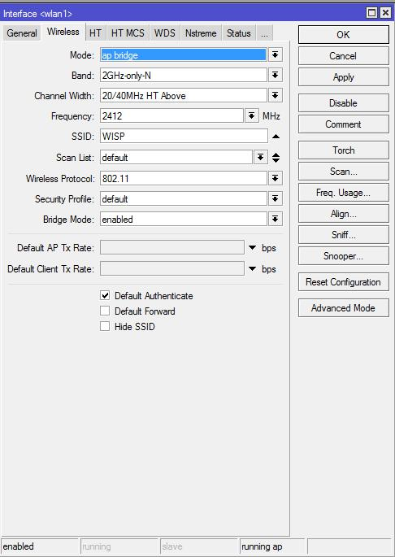
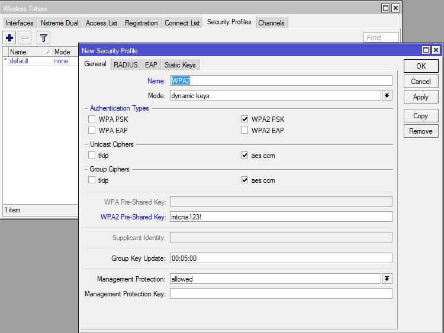
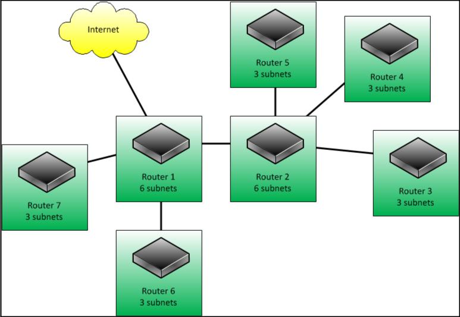

# M2 Routing

**Module 2**

## **Routing Overview**

Routing concepts

* Routing is a layer 3 process on the ISO’s OSI model.
* Routing defines where traffic is forwarded \(sent\).
* It’s required to permit different subnets to communicate.

– Even if they should be on the same “wire”

Routing concepts, example 1

* Computers wont communicate.

Routing concepts , example 2

* Computers can now communicate.

Route flags

* Routes have statuses. In this course, we will familiarize ourselves the following:

– X : Disabled

– A : Active

– D : Dynamic

– C : Connected

– S : Static

Route flags

* **Disabled** : Route is disabled. Has no influence in the routing process.
* **Active** : Route is active and used in the routing process.
* **Dynamic** : Route has been created by routing process, not through the management interface.

Route flags

* **Connected** : Routes are created for each IP subnet that has an active interface on router.
* **Static** : Route created to force forwarding of packets through a certain .

## **Static Routing**

Static routes

* Routes to subnets that exist on a router are automatically created and known by that router. But what happens if you need to reach a subnet that exists on another router? You create a static route!
* A static route is a manual way of forwarding traffic to unknown subnets.

Static routes

Static routes

* Understanding the fields

– **Flags** : The state of each route, as explained in previous slides

– **Dst. Address** : The destination addresses this route is used for.

– **Gateway** : Typically, the IP address of the next hop that will receive the packets destined for “_**Dst. Address**_”.

**Distance** : Value used for route selection.

– In configurations where various distances are posible, the route with the smallest

Why use static routing

* Makes configuration simpler on very small network which will most likely not grow.
* Limits the use of router resources \(memory, CPU\)

Limits of static routing

* Doesn’t scale well.
* Manual configuration is required every time a new subnet needs to be reached.

| Limits of static routing, example |
| :--- |
|  |
| Your network grows and you need to add links to remote routers \(and subnets\). |
| • Assume that all routers have 2 LAN subnets and 1 or more WAN subnets. |
|  |

Limits of static routing, example

How many static routes to add on router-1?

* Routers 3 to 5 : 9
* Router 2 : 2
* Router 6 and 7 : 4

| **Total of 15 static** |  |  |
| :--- | :--- | :--- |
| **routes to add** |  |  |
| **manually!!** |  |  |
|  |  |  |

Creating routes

| • To add a static |  |  |
| :--- | :--- | :--- |
| route : |  |  |
| – | IP -&gt; Routes |  |
| – | + \(Add\) |  |
| – | Specify |  |
|  | destination |  |
|  | subnet and mask |  |
| – | Specify |  |
|  | “Gateway” \(next |  |
|  | hop\) |  |
|  |  |  |

Setting the default route

* The route 0.0.0.0/0

– Known as the **Default route**.

– It is the destination where all traffic to unknown subnets will be forwarded.

– It is also a static route.

Managing dynamic routes

* As mentioned before, dynamic routes are added by the routing process, not by the administrator.
* This is done automatically.
* You can’t manage dynamic routes. If the interface to which the dynamic route is linked goes down, so does the route!

Managing dynamic routes, example

Implementing static routing on simple networks

Consider the following example.

Implementing static routing on simple networks

* Exercise:

Assuming ip addresses have been properly entered, what commands would you use to enable complete communications for both subnets \(LAN1 and LAN2\)?

\(Answer on next slide. Don’t peak \)

Implementing static routing on simple networks

* router-1

/ip route

add gateway=172.22.0.18

add dst-address=10.1.2.0/24 gateway=10.0.0.2

* router-2

/ip route

add gateway=10.0.0.1

Time for a practical exercise

## Laboratory

* Goals of the lab

– Gain connectivity to other POD LANs

– Validate use of default route

– View and explain route flags

Laboratory : Setup

Laboratory : step 1

* Delete the default route that was created in module 1
* Ping other PODs’ computers. Note results
* Create static routes to other PODs’ LAN subnets
* Ping other PODs’ computers. Note results

Laboratory : step 2

* Open a Web browser and try accessing Mikrotik’s Web page. Note results
* Create the default route using the trainer’s router as the gateway
* Open a Web browser and try accessing Mikrotik’s Web page. Note results

**End of Laboratory 2**

