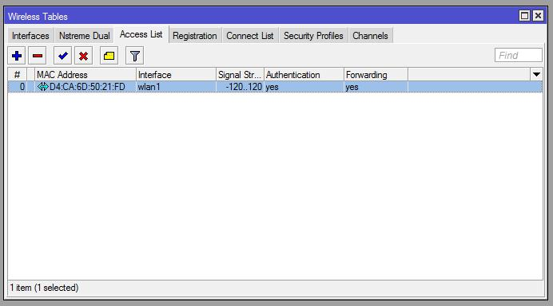
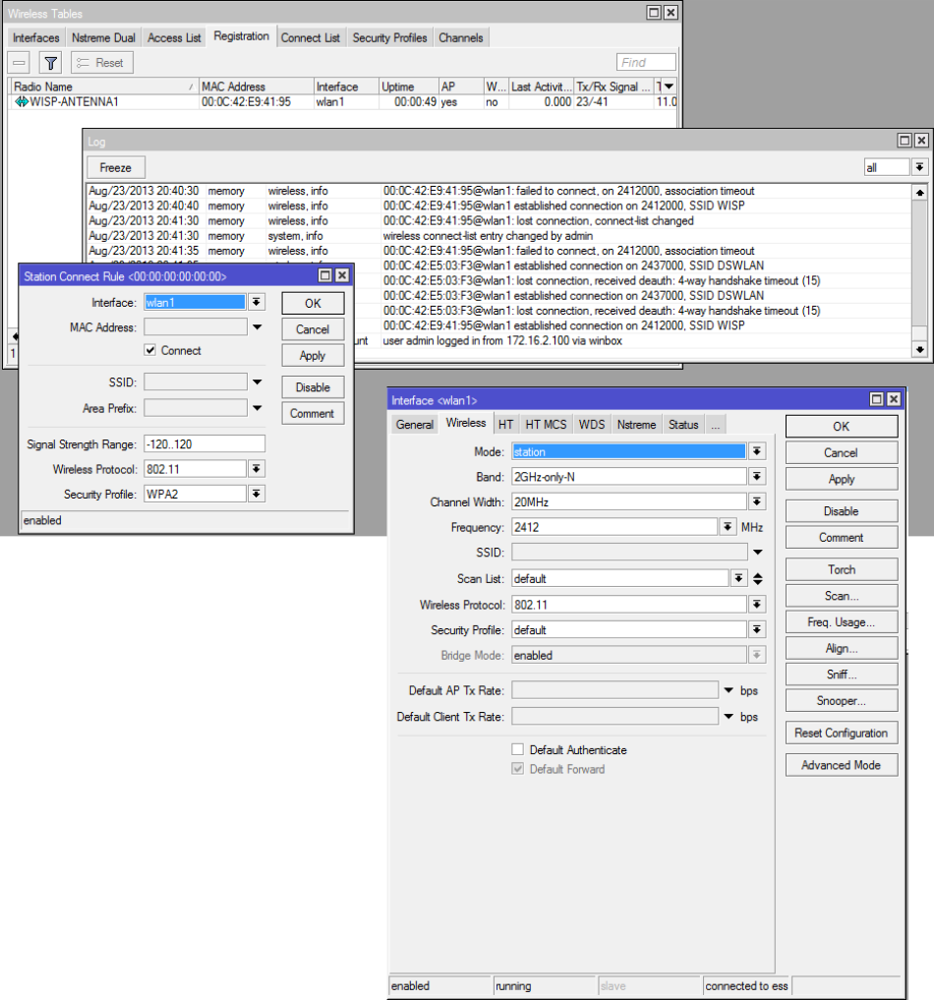
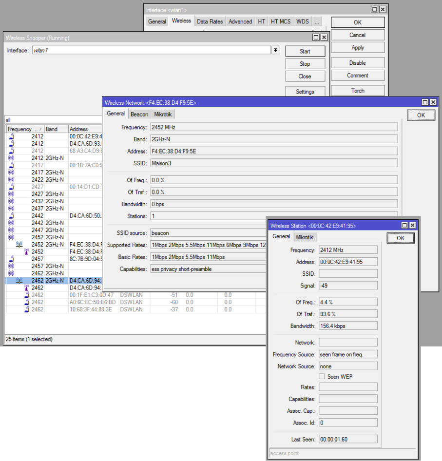

# M4 Wireless

## Концепция **802.11**

### Частоты

* 802.11b
  * 2.4GHz (ширина полосы 22MHz), 11Mbps
* 802.11g
  * 2.4GHz (ширина полосы 22MHz), 54Mbps
* 802.11a
  * 5GHz (ширина полосы 20MHz), 54Mbps
* 802.11n
  * 2.4GHz или 5GHz до 300Mbps, если используется канал 40MHz и 2 радио (каналы)

* 802.11b,g диапазон частот
* Каналы 1, 6 и 11 неперекрывающиеся

* 802.11a частотный диапазон
* 12 каналов с шириной 20MHz и 5 с шириной 40MHz
* Диапазон
  * Mikrotik поддерживает оба 5GHz (802.11a/n) и 2.4GHz (802.11b/g/n)
* Функция “Advanced Channels” предоставляет расширенные возможности в конфигурации беспроводного интерфейса:
  * скан-список, который охватывает несколько полос и широт каналов;
  * нестандартные центральные частоты канала \(заданные с детализацией кГц\) для аппаратных средств, которые позволяют это;
  * нестандартные широты канала \(заданные с детализацией кГц\) для аппаратного обеспечения, которое позволяет это.
* Базовые скорости - это скорости, которые клиент ДОЛЖЕН поддерживать для подключения к точке доступа.
* Поддерживаемые скорости - это скорости, которые могут быть достигнуты после того, как соединение было принято \(факторы могут влиять на максимальную скорость, достигнутую\)
* Скорость передачи данных - это поддерживаемая скорость в соответствии с используемым стандартом.
  * 802.11b: от 1 до 11Mbps
  * 802.11a/g: от 6 до 54Mbps
  * в зависимости от таких факторов, как пропускная способность канала \(20 или 40 МГц\), защитный интервал \(GI\) и цепи
* HT цепи
  * Есть антенны для одного радио
  * Используется для 802.11n и является фактором пропускной способности
* Частотный режим
  * Regulatory-domain: ограничение каналов и мощность передатчика на основе положения страны.
  * Manual-txpower: то же самое, что и выше, но без ограничения мощности TX.
  * Superchannel: будет игнорировать все ограничения
* Параметр “Country”: частоты и ограничения мощности основаны на правилах ”_country_". Использование "_no\_country\_set_" настроит одобренный FCC набор каналов.

## Настройка простой беспроводной связи

* Конфигурация точки доступа
  * Mode : ap bridge
  * Band : основанный на возможностях маршрутизатора и клиентов. Если AP поддерживает несколько полос \(например. B/G/ N\) выберите тот, который лучше всего соответствует вашим потребностям
  * Frequency : любой из доступных каналов \(мы поговорим об этом позже!!\)
  * SSID : идентификатор беспроводной сети для поиска клиентами
  * Wireless protocol : основан на возможностях маршрутизатора и клиентов. Для ”нормальных" соединений AP на ПК используйте 802.11

* **ПОЖАЛУЙСТА**, НАСТРОЙТЕ ПРОФИЛЬ БЕЗОПАСНОСТИ!
  * Не делать этого - полное нарушение безопасности. Это оставляет вашу сеть широко открытой!
* Добавление профиля безопасности
  * Нажмите кнопку “Add” \(+\)
  * Name: Имя профиля
  * Mode: используемый тип аутентификации
  * Authentication types: методы, используемые для проверки подлинности соединения
  * Ciphers: методы шифрования

* Теперь вы можете использовать свой новый профиль безопасности и чувствовать себя в безопасности в своей беспроводной сети

* Вернемся к частотам! Какую из них использовать?
  * Кликните “Snooper”
  * Опасно! Это отключит интерфейс wlan и подключенных клиентов
  * У вас будет полное представление об используемых диапазонах и частотах
  * Выберите свободный канал или, по крайней мере, канал с низким уровнем загруженности

* Конфгурация станции
  * Mode : station
  * Band : В соответствии с вашей точкой доступа
  * Frequency : для клиентов неважно

* Конфигурация станции
  * SSID : должно соответствовать точке доступа, к которой подключаетесь
  * Wireless protocol : должен соответствовать точке доступа, к которой подключаетесь
  * Создайте профиль безопасности, как показано в конфигурации "точка доступа", и примените его здесь. Параметры ДОЛЖНЫ совпадать.

## Фильтрация MAC-адресов

* Фильтрация MAC-адресов является дополнительным способом ограничения соединения с клиентами.
* Чтобы добавить запись в список доступа \(на ТД!!\), выберите зарегистрированный узел и нажмите кнопку “Copy to Access list”

* Теперь у Вас есть новая запись!

Фильтрация MAC-адресов

* Списки доступа используются **на ТД** для ограничения подключений к определенным клиентам и управления их параметрами подключения.
  * Правила проверяются последовательно
  * Применяется только первое совпадающее правило
  * Если параметр “Default Authenticate” \(вкладка _”Wireless“_ на экране _”Interface -&gt; wlan"_\) снята, устройства, не соответствующие правилу списка доступа, отклоняются

* Параметр **Authentication** укажет маршрутизатору проверить "security-profile", чтобы определить, должно ли соединение быть разрешено. Если флажок снят, проверка подлинности всегда завершается ошибкой.
* Параметр Forwarding укажет маршрутизатору, чтобы позволил клиентам ТД связаться друг с другом без помощи ТД \(таким образом, минуя правила брандмауэра, которые у вас могут быть\). Для дополнительной безопасности отключите.
* AP TX Limit ограничивает скорость передачи данных от ТД к клиенту
  * Установка слишком низкого уровня может вызвать проблемы с подключением. Сперва протестируйте!
* Client TX Limit ограничивает скорость передачи данных от клиента к точке доступа
  * Собственное расширение, которое поддерживается только клиентами RouterOS
  * Опять же, вы должны протестировать, чтобы увидеть приемлимое значение

* Connect List \(cписки соединений\) \(на клиентских станциях\) назначают приоритеты на основе параметров уровня сигнала и безопасности, которые определяют, к каким точкам доступа клиент может подключиться
  * Правила проверяются последовательно
  * Применяется только первое совпадающее правило
  * Если опция ”Deafult Authentificate“ \(вкладка _”Wireless“_ на экране _”Interface -&gt; wlan"_\) проверена и не соответствует правилам списка соединений, клиент попытается подключиться на основе лучшей совместимости сигнала и безопасности

* Пример: У этой станции не определены **SSID** или **Security** **profile**, но поскольку у нее есть соответствие списка соединений, соединение было установлено

* **Интересное замечание**: Если поле SSID \(_в правилах подключения станции_\) пусто, клиент подключится к любому SSID с соответствующим **Security profile**.
* Поле SSID интерфейса так же должно быть пустым!

* Default-authentication : задает поведение после проверки списков доступа и подключения.
  * Для точек доступа, если установлено в yes - разрешит соединение, если нет соответствия в списке доступа, предоставленного интерфейсу SSID и соответствия профиля безопасности. В противном случае никакие соединения не допускаются.
  * Для станций, если задано значение yes, будут разрешены соединения, если нет совпадения в списке соединений, предоставленного интерфейсу SSID и профиля безопасности. В противном случае никакие связи не допускаются.
  * Если у ТД нет списка доступа и default-authenticate не установлено, клиенты никогда не смогут подключиться
  * Если у станции нет списка подключений и default-authenticate не установлен, она никогда не подключится к точке доступа
* Default-forwarding : задает поведение переадресации клиентов после проверки списков доступа.
  * Если установлено значение да, будет разрешена связь 2 уровня между клиентами.
  * Если установлено нет - клиенты будут по-прежнему видеть друг друга \(на уровне 3\), ЕСЛИ это разрешено правилами брандмауэра.

## Безопасность и шифрование беспроводного соединения

* WPA, WPA2
  * Wi-Fi защищенный доступ \(I и II\)
  * Протокол аутентификации, созданный после обнаружения слабых мест в WEP
  * При правильной настройке WPA весьма безопасен
    * Слабые места для атак брутфорсом были обнаружены при использовании WPS \(Wi-Fi Protected Setup\)
    * WPS не используется Mikrotik
* WPA
  * Используется для замены WEP \(найдены слабые места\)
  * Использует TKIP в качестве протокола шифрования
    * Генерирует новый ключ для каждого пакета
* WPA2
  * Использует CCMP в качестве протокола шифрования
    * Основан на AES
    * Сильнее чем TKIP
  * Является обязательным в Wi-Fi сертифицированных устройствах с 2006 года
  * Должен использоваться для достижения более высокой скорости передачи данных, иначе ограничивается 54 Мбит/с \([_http://www.intel.com/support/wireless/wlan/4965agn/sb/cs-025643.htm_](http://www.intel.com/support/wireless/wlan/4965agn/sb/cs-025643.htm)\)
* WPA-Personal
  * Также известен как WPA-PSK, предназначен для небольших офисов и дома
  * Не требует сервера аутентификации
  * Аутентификация клиента на ТД основана на 256-битном ключе, созданном из предварительно общедоступного ключа \(PSK\), который может быть паролем или парольной фразой, известной обоим
* WPA-Enterprise
  * Также упоминается как режим WPA-802.1X, предназначен для корпоративных сетей
  * Использует EAP для аутентификации
  * Требуется сервер проверки подлинности RADIUS
  * Более сложное развертывание, но предоставляет дополнительные функции, такие как защита от атак по словарю на более слабые пароли

## Протоколы беспроводных соединений MikroTik

* NV2 \(Nstreme Version 2\)
  * Проприетарный протокол Mikrotik во второй версии
  * Для использования с беспроводным чипом Atheros 802.11.
  * На основе TDMA \(_Множественный доступ с разделением по времени_\) вместо CSMA \(_Множественный доступ с контролем несущей_\)\(_Carrier Sense Multiple Access_\)
  * Используется для повышения производительности на больших расстояниях
* Преимущества NV2
  * Увеличенная скорость
  * Больше клиентских подключений в многопользовательских средах \(ограничение в 511 клиентов\)
  * Снижение задержек
  * Отсутствие ограничений по расстоянию
  * Нет штрафов за большие расстояния

## Инструменты мониторинга

* Существуют различные инструменты, которые помогут вам проанализировать, что находится в воздухе, так что вы можете выбрать частоту без \(или с наименьшим количеством\) помех
* Беспроводное сканирование: два варианта
  * Frequency Usage
  * Scan

* Wireless scan : Frequency Usage
  * Показывает все поддерживаемые частоты и их использование соседними точками доступа
  * **Удаляет подключенных беспроводных клиентов!**

* Wireless scan : Scan
  * Дает информацию о соседних точках доступа
  * **Удаляет подключенных беспроводных клиентов!**

* Snooper
  * Предоставляет более подробную информацию о других точках доступа и клиентах
  * **Удаляет подключенных беспроводных клиентов!**

* Snooper
  * Дает более подробную информацию о других AP и станций, дважды щелкнув
* Registration table : Используется для получения информации о подключенных клиентских станциях.
  * Полезно только на точках доступа.

* Registration table
  * Мы можем видеть текущее состояние соединения станции
  * Примечание: комментарии, появляющиеся над станциями, находятся на вкладке "Access List". Полезно посмотреть, по каким критериям станция была авторизована

## Соединение беспроводвных сетей

* Station-bridge : проприетарный режим Mikrotik для создания безопасного L2-моста между маршрутизаторами Mikrotik
* Может использоваться для расширения беспроводной подсети для большего количества клиентов

Время для практических занятий

## Лабораторка

* Цель лабораторки
  * Используйте различные инструменты для анализа используемых каналов и характеристик беспроводных сетей, точек доступа и станций
  * Настройте под маршрутизаторы как беспроводные клиенты к маршрутизатору учителя
  * Настройте под маршрутизаторы как беспроводные точки доступа
  * Ознакомьтесь со списками подключений и списками доступа

Лабораторка: Установка

Лабораторка: Предварительная подготовка

* **ПРЕЖДЕ ЧЕМ МЫ ЧТО-НИБУДЬ СДЕЛАЕМ!!!**
  * Сделайте бинарную резервную копию текущей конфигурации под именем:
    * Module3-pod<i>X</i> где _X_ это ваш подномер
  * Как бы вы это сделали?
  * Какие окна вы бы открыли?

### Лабораторка: шаг 1

* Запустите один за другим:
  * Frequency Usage
    * Запишите наиболее используемые каналы
  * Scan
    * Создайте связь между частотами и видимыми SSID
  * Snooper
    * Что вы можете сказать о видимых сетях?
    * Что представляют собой символы в левом столбце?

### Лабораторка: шаг 2

* Откройте окно “Bridge” и перейдите во вкладку the “Ports”
* Используя процедуры, которые мы видели в предыдущих модулях, добавьте интерфейс “wlan1” к подключению “LAN”.
* Закройте окно “Bridge”

### Лабораторка: шаг 3

* Откройте окно “Wireless” и убедитесь что интерфейс “wlan1” включен

### Лабораторка: шаг 4

* Кликните дважды на интерфейсе и перейдите на вкладку Wireless”. Нажмите кнопку "Advanced Mode”, затем введите следующие параметры:
  - Mode: ap bridge
  - Band: 2GHz-B/G/N
  - Channel width: 20MHz
  - Frequency: Odd pods use 2437, even pods use 2462
  - SSID: pod<i>X</i>
  - Wireless protocol: 802.11
  - Security Profile: default **(что было бы _ПЛОХОЙ_ идеей в любое другое время)**
  - Frequency Mode: Regulatory-domain
  - Country: _<где_вы_сейчас_находитесь>_
  - Default Authenticate is checked

### Лабораторка: шаг 5

* Отключите сетевой кабель между ноутбуком и маршрутизатором. Кабель от вашего маршрутизатора к маршрутизатору учителя должен остаться
* Настройте Ваш ноутбук для использования параметров wi-fi вашего маршрутизатора
* Убедитесь, что у вас есть подключение wi-fi
* Подключитесь к Интернету

### Лабораторка: шаг 6

* Сделайте двоичную резервную копию текущей конфигурации под именем:
  - Module4a-pod<i>X</i>, где _X_ - номер вашего модуля
* В окне "File List" выберите module3-pod<i>X</i> и нажмите на кнопку "Restore" в верхней части окна
* Ответьте “Yes”, чтобы перезагрузить маршрутизатор.

### Лабораторка: шаг 7

* Подключите сетевой кабель вашего ноутбука к маршрутизатору.
* Отсоедините сетевой кабель вашего маршрутизатора от маршрутизатора преподавателя.
* Теперь у вас не должно быть доступа в Интернет

### Лабораторка: шаг 8

**Предварительная подготовка**

* IP-адрес для WLAN1
  - 192.168.252.pod<i>X</i>
* Включите интерфейс wlan1, если он не включен
* Профиль безопасности
  - Name: WPA2
  - Authentication types: WPA2 PSK
  - Unicast and group ciphers: aes ccm
  - WPA2 pre-shared key: mtcna123!

### Лабораторка: шаг 9

* Активируйте “Advanced Mode” во вкладке "Wireless" раздела "Interface <wlan1>"
* Нам нужно подключиться к точке доступа класса. Следующие параметры должны быть совместимы с параметрами точки доступа для подключения.
  - Mode: Station
  - Band: 2GHz-only-N
  - SSID: WISP
  - Radio name: WISP-POD<i>X</i>
  - Wireless protocol: 802.11
  - Security profile: WPA2

### Лабораторка: шаг 10

* Frequency Mode: regulatory-domain
* Country: выбирите страну, в которой будет установлена ТД.
* Оставьте пока флажок “Default Authenticate”
* Кликните OK и выберите вкладку “Registration” в окне “Wireless Tables”
* Вы должны видеть, как появляется ТД учителя. Если это так, то вы подключены!
  - **Но подождите!!!**

### Лабораторка: шаг 11

* Прежде чем просмотр сможет работать, давайте исправим наши таблицы маршрутизации.
  - Переопределите шлюз по умолчанию на 192.168.252.254
  - Переопределите маршрут к локальному интерфейсу модуля вашего соседа (192.168._Y_.1) через 192.168.252._Y_
  - Проверьте пинг до сетевого интерфейса модуля вашего соседа (192. 168._Y_.1)
    - Каков же результат?

**Конец 4 лабораторки**
