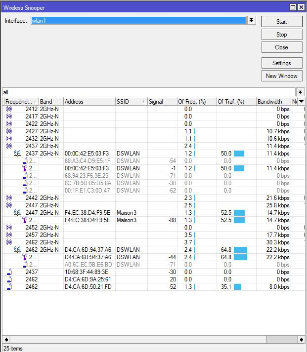
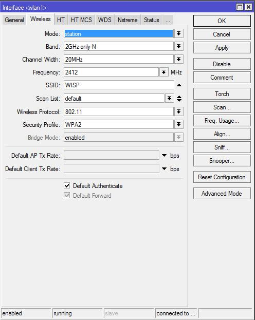
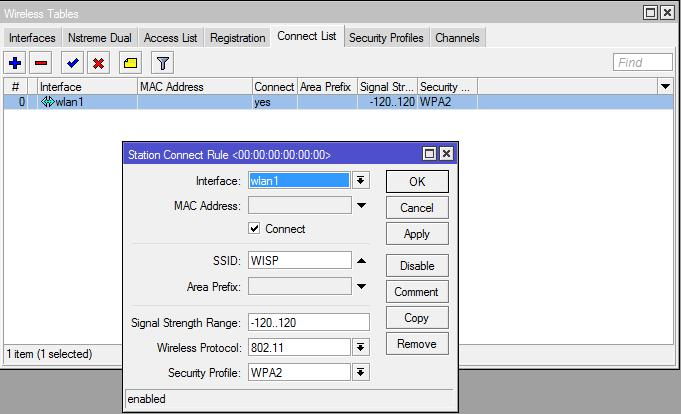
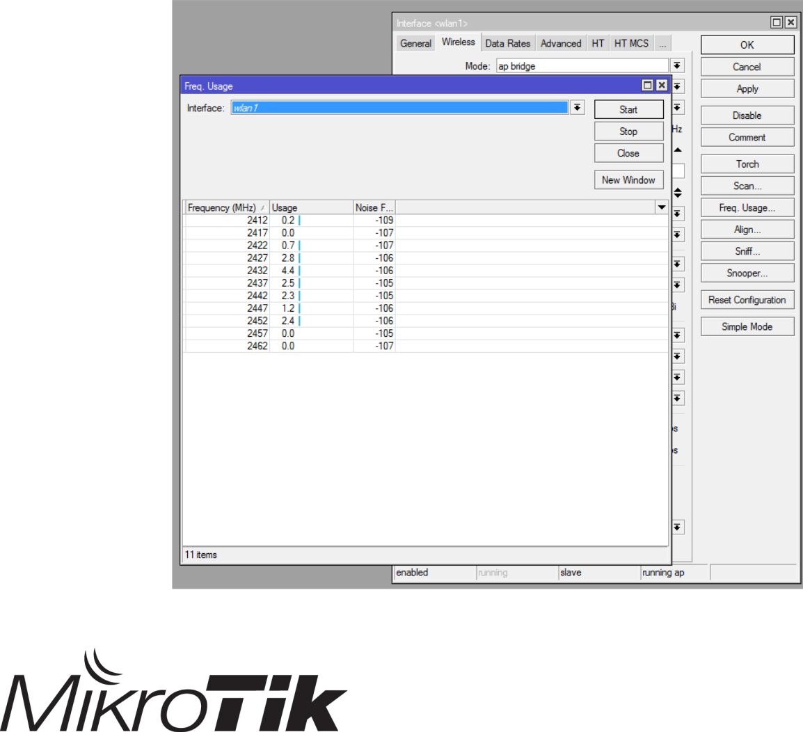
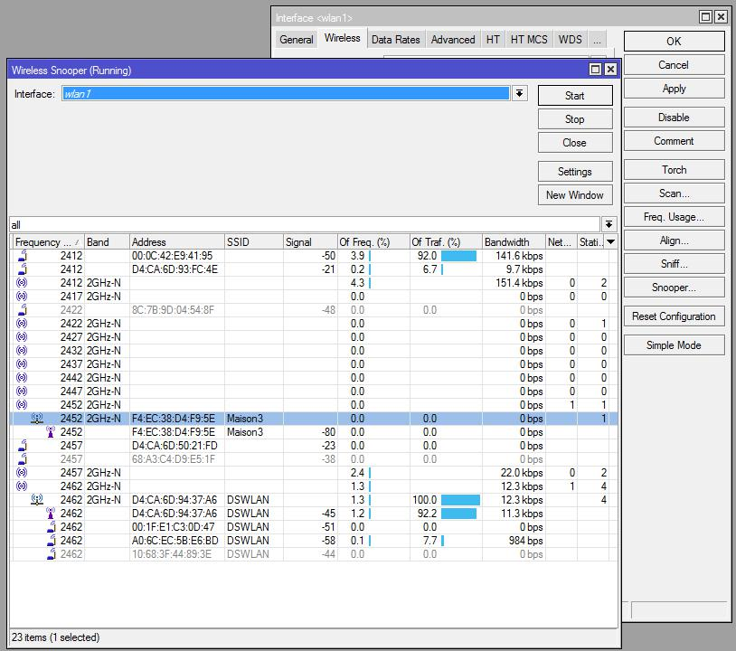
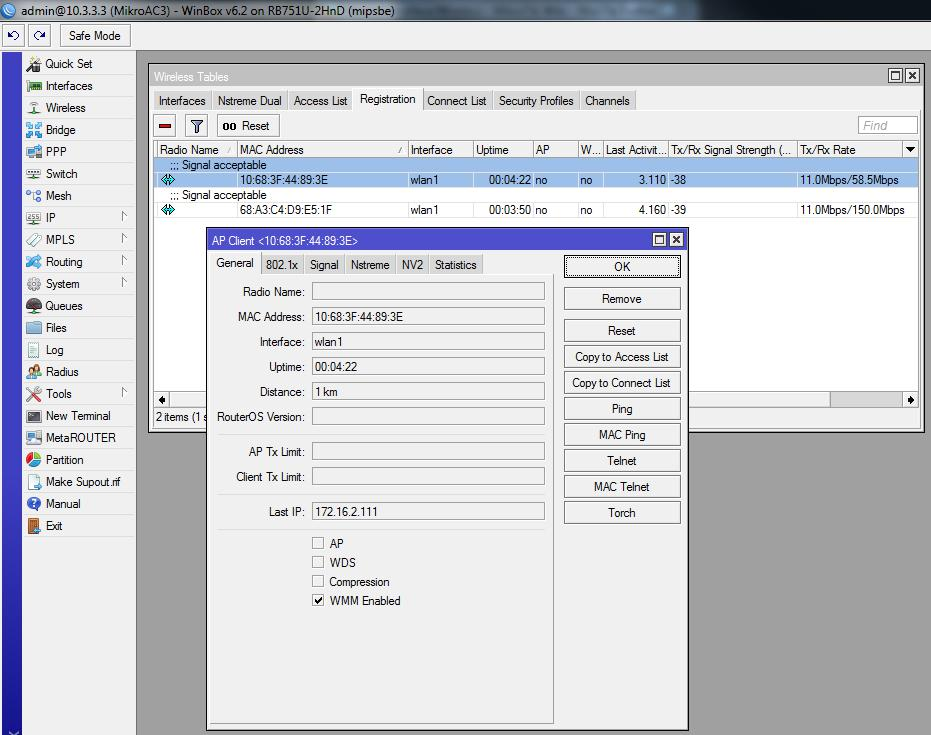
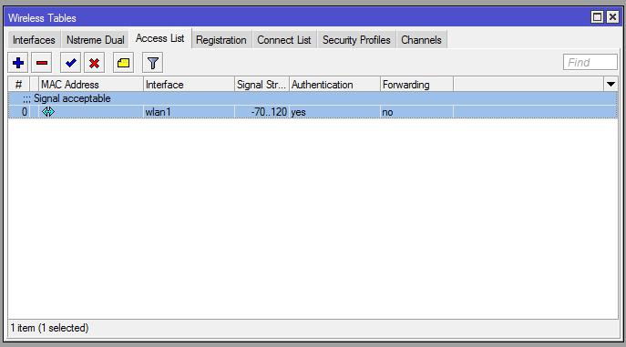
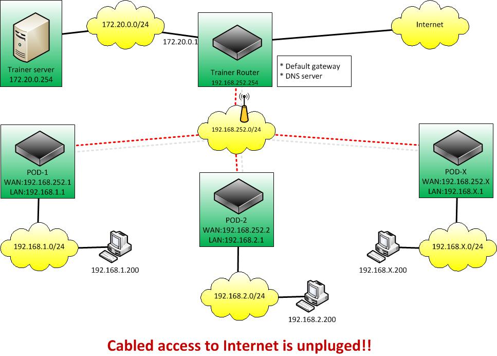

# M4 Wireless

## Концепция **802.11**

### Частоты

* 802.11b
  * 2.4GHz \(ширина полосы 22MHz\), 11Mbps
* 802.11g
  * 2.4GHz \(ширина полосы 22MHz\), 54Mbps
* 802.11a
  * 5GHz \(ширина полосы 20MHz\), 54Mbps
* 802.11n
  * 2.4GHz или 5GHz до 300Mbps, если используется канал 40MHz и 2 радио \(каналы\)

* 802.11b,g диапазон частот
* Каналы 1, 6 и 11 неперекрывающиеся

* 802.11a частотный диапазон
* 12 каналов с шириной 20MHz и 5 с шириной 40MHz
* Диапазон
  * Mikrotik поддерживает оба 5GHz \(802.11a/n\) и 2.4GHz \(802.11b/g/n\)
* Функции “Advanced Channels” предоставляет расширенные возможности в конфигурации беспроводного интерфейса:
  * scan-list that covers multiple bands and channel widths;
  * non-standard channel center frequencies \(specified with KHz granularity\) for hardware that allows it;
  * non-standard channel widths \(specified with KHz granularity\) for hardware that allows it.
* Basic-rates are the speeds that a client MUST support in order to connect to an AP
* Supported-rates are the speeds that can be achieved once the connection has been accepted \(factors may influence top speed achieved\)
* Data-rates are the supported rates according to the standard being used.
  * 802.11b : 1 to 11Mbps
  * 802.11a/g : 6 to 54Mbps
  * 802.11n : 6 to 300Mbps, according to factors such as channel bandwidth \(20 or 40 MHz\), Guard Interval \(GI\), and chains
* HT chains
  * Are antennas for one radio
  * Used for 802.11n and is a factor in throughput
* Frequency mode
  * Regulatory-domain : Limit channels and TX power based on country regulations.
  * Manual-txpower : Same as above but without TX power restriction.
  * Superchannel : Will ignore all restrictions
* “Country” parameter : Frequencies and power limitations are based on “_country_”’s regulations. Using “_no\_country\_set_” will configure FCC approved set of channels.

Setting-up a simple wireless link

* Access point configuration
  * Mode : ap bridge
  * Band : Based on router’s and clients’ capacities. If AP supports multiple bands \(ex. B/G/N\) select the one that best fits your needs
  * Frequency : Any of the available channels \(_we’ll talk more about_ _this later on!!_\)
  * SSID : The wireless network’s identity clients will look for
  * Wireless protocol : Based on router’s and clients’ capacities. For “normal” AP to PC links, use 802.11

Setting-up a simple wireless link

* **PLEASE** SET-UP A SECURITY PROFILE!

– Not doing it is a total security breach. It leaves your network wide open!

Setting-up a simple wireless link

* To add a security profile
  * Click on “Add” \(+\)
  * Name : The profile’s name
  * Mode : Type of authentication to use
  * Authentication types : Methods used to authenticate a connection
  * Ciphers : Encryption methods

Setting-up a simple wireless link

* Now you can use your new security profile and feel better about your wireless network’s security

Setting-up a simple wireless link

* Back to frequencies! Which one to use?
  * Click on “Snooper”
  * Beware! This WILL disconnect the wlan interface and associated clients

Setting-up a simple wireless link

* Back to frequencies! Which one to use?

– Click on “Snooper”

– Beware! This WILL disconnect the wlan interface and associated clients

– You have a complete view of used bands and frequencies

– Select a free channel or, at least, one with low usage

Setting-up a simple wireless link

* Station configuration

– Mode : station

– Band : To match your AP.

– Frequency : Not important for clients

Setting-up a simple wireless link

* Station configuration

– SSID : To match the AP you wish to connect to

– Wireless protocol : To match the AP you wish to connect to

– Create a security profile, as demonstrated in “access point” configuration, and apply it here. Parameters MUST match

MAC address filtering

* MAC address filtering is an extra way of limiting connection from clients.
* To add an entry to an Access List \(on an AP!!\), select a registered node and click “Copy to Access list”

MAC address filtering

* You now have a new entry!

MAC address filtering

* Access lists are used **on** **APs** to restrict connections to specific clients and control their connection parameters.
  * Rules are checked sequentially
  * Applies only the first matching rule
  * If “Default Authenticate” option \(“_Wireless_” tab in “_Interface -&gt; wlan_ ” screen\) is unchecked, devices that do not match an access-list rule are rejected

MAC address filtering

* **Authentication** option will tell router to check the “security-profile” to determine if connection should be allowed. If unchecked, authentication will always fail.
* Forwarding option will tell the router to allow clients of the AP to reach each other without the APs assistance \(thus bypassing firewall rules you may have\) . For added security, leave unchecked

MAC address filtering

* AP Tx Limit restricts data rate from AP to client
  * Setting it too low might cause connection problems. Test first!
* Client TX Limit restricts data rate from client to AP

–

–

Proprietary extension that is supported only by RouterOS clients

Again, you may want to test to see what’s acceptable

MAC address filtering

* Connect lists \(on client stations\) assign priorities, based on signal strength and security settings, that specify to which APs the client can connect to

| Rules are checked sequentially |  |
| :--- | :--- |
|  |  |
| Applies only the first matching rule |  |
|  |  |
| If “Default Authenticate” option \(“_Wireless_” tab in |  |
|  |  |
| “_Interface -&gt; wlan_ ” screen\) |  |
| is checked and no connect- |  |
| list rule is matched, client |  |
| will attempt connexion |  |
| based on best signal and |  |
| security compatibility | 25 |

MAC address filtering

* Example : This station has no **SSID** or **Security** **profile** defined, but because it has a connect-list match, a connexion was established

MAC address filtering

* **Interesting note** : If the SSID field \(_in station connect_ _rule_\) is empty, the client will connect to any SSID with a matching **Security profile** .
* Interface SSID field must also be empty!

MAC address filtering

* Default-authentication : Specifies behavior following verification of access and connect lists.

– For APs, if set to yes, will allow connections if there is no access-list match provided interface SSID and security profile match. Otherwise, no connexions are allowed.

– For stations, if set to yes, will allow connections if there is no connect-list match provided interface SSID and security profile match. Otherwise, no connexions are allowed.

MAC address filtering

* Default-authentication

– If AP has no access list, and default-authenticate is unchecked, clients will never connect

– If station has no connect list, and default-authenticate is unchecked, it will never connect to an AP

MAC address filtering

* Default-forwarding : Specifies forwarding behavior of clients following verification of access lists.

– If set to yes, will allow layer 2 communications between clients.

– If set to no, clients will still see each other \(at layer 3\) IF firewall rules permit it.

Wireless security and encryption

* WPA, WPA2

– Wi-Fi Protected Access \(I and II\)

– Authentication protocol created after weaknesses were found in WEP

– If properly set-up, WPA is very secure

* * * Weaknesses to brute force attacks were found when using WPS \(Wi -Fi Protected Setup\)
    * WPS not used by Mikrotik

Wireless security and encryption

* WPA

– Used to replace WEP \(weaknesses found\)

– Uses TKIP as encryption protocol

* * * Generates a new key for each packet

Wireless security and encryption

* WPA2

– Uses CCMP to replace as encryption protocol

* * * Based on AES
    * Stronger than TKIP

– Is mandatory in Wi-Fi certified devices since 2006

– Must be used to achieve higher bitrates, otherwise limited at 54Mbps \([http://](http://www.intel.com/support/wireless/wlan/4965agn/sb/cs-025643.htm)[www.intel.com/support/wireless/wlan/4965agn/sb/cs-025643.htm](http://www.intel.com/support/wireless/wlan/4965agn/sb/cs-025643.htm)\)

Wireless security and encryption

* WPA-Personal

– Also referred to as WPA-PSK, is designed for small offices and the home

– Does not require an authentication server

– Client to AP authentication is based on a 256-bit key generated from a pre-shared key \(PSK\), which can be a password or passphrase, known to both

Wireless security and encryption

* WPA-Enterprise

– Also referred to as WPA-802.1X mode, is designed for enterprise networks

– Uses EAP for authentication

– Require a RADIUS authentication server

– More complicated to deploy, but provides added features such as protection against dictionary attacks on weaker passwords

MikroTik wireless protocols

* NV2 \(Nstreme Version 2\)

– A Mikrotik proprietary protocol in it’s second version

– For use with the Atheros 802.11 wireless chip.

– Based on TDMA \(_Time Division Multiple_ _Access_\) instead of CSMA \(_Carrier Sense Multiple Access_\)

– Used to improve performance over long distances

MikroTik wireless protocols

* NV2 benefits

– Increased speed

– More client connections in point to multipoint environments \(limit is 511 clients\)

–

–

–

Lower latency

No distance limitations

No penalty for long distances

Monitoring tools

* There are various tools that will help you analyse what’s in the air so you can choose the frequency with no \(or the least\) interference

Monitoring tools

* Wireless scan : Two options

– Frequency usage

– Scan

Monitoring tools

* Wireless scan : Frequency Usage

– Shows all supported frequencies and their usage by neighboring APs

– **Drops** **connected wireless clients!**

Monitoring tools

* Wireless scan : Scan

– Gives information about neighboring APs

– **Drops** **connected wireless clients!**

Monitoring tools

* Snooper

– Gives more detailed information about other APs AND clients

– **Drops connected** **wireless clients!**

Monitoring tools

* Snooper

– Gives more detailed information about other Aps AND stations by double-clicking

Monitoring tools

* Registration table : Used to get information on connected client stations.

– Useful only on access points.

Monitoring tools

Monitoring tools

• Registration table

| – | We can see |  |
| :--- | :--- | :--- |
|  | current station |  |
|  | connection status |  |
| – | Note : Comments |  |
|  | appearing above |  |
|  | stations is from |  |
|  | “Access List” tab. |  |
|  | Useful to see |  |
|  | under which |  |
|  | criteria station |  |
|  | was authorized |  |

Bridging wireless networks

* Station-bridge : A Mikrotik proprietary mode to create a secure L2 bridge between Mikrotik routers
* Can be used to expand a wireless subnet to many clients

Time for a practical exercise

**End of module 4**

Laboratory

* Goals of the lab

– Use the various tools to analyze used channels and characteristics of wireless networks, APs and stations

– Configure pod routers as wireless clients to the teacher’s router

– Configure pod routers as wireless APs

– Familiarise yourselves with Connect Lists and Access lists

Laboratory : Setup

Laboratory : Preliminary step

* **BEFORE WE DO ANYTHING!!!**

– Do a binary backup of the current configuration under the name:

* * * Module3-pod_X_ where _X_ is your pod number

– How would you go about doing it?

– What windows would you open?

Laboratory : step 1

* Launch, one after the other :

– Frequency Usage

* * * Write down channels with most usage

– Scan

* * * Make a link between frequencies and visible SSIDs

– Snooper

* * * What can you tell from the visible networks?
    * What do the symbols in the left column represent?

Laboratory : step 2

* Open the “Bridge” window and go to the “Ports” tab
* By using the procedures that we saw in previous modules, add “wlan1” interface to “LAN” bridge.
* Close the “Bridge” window

Laboratory : step 3

* Open the “Wireless” window and make sure the “wlan1” interface is enabled

Laboratory : step 4

* Double-click on the interface and go to the “Wireless” tab. Click “Advanced Mode”, then enter the following parameters:

–

–

–

–

–

–

–

–

–

–

Mode : ap bridge

Band : 2GHz-B/G/N

Channel width : 20MHz

Frequency : Odd pods use 2437, even pods use 2462

SSID : pod_X_

Wireless protocol : 802.11

Security Profile : default **\(which would be a** _**BAD**_ **idea any** **other time\)**

Frequency Mode : Regulatory-domain

Country : &lt;_where you are now_&gt;

Default Authenticate is checked

Laboratory : step 5

* Remove the network cable between your laptop and router. The cable from your router to the teacher’s router must stay
* Set-up you laptop to use your router’s wi-fi parameters
* Ensure that you have wi-fi connectivity
* Connect to the Internet

Laboratory : step 6

* Do a binary backup of the current configuration under the name:

– Module4a-pod_X_ where _X_ is your pod number

* From the “File List” window, select module3-pod_X_ and click on the “Restore” button on the top part of the window
* Answer “yes” to reboot the router

Laboratory : step 7

* Reconnect your laptop’s network cable to your router
* Disconnect your router’s network cable to the teacher’s router
* You should now have no Internet access

Laboratory : step 8

**Preliminary work**

* IP address for WLAN1

– 192.168.252.pod_X_

* Enable wlan1 interface if such is not the case
* Security profile

– Name : WPA2

– Authentication types : WPA2 PSK

– Unicast and group ciphers : aes ccm

– WPA2 pre-shared key : mtcna123!

Laboratory : step 9

* Activate the “Advanced Mode” in the “Wireless” tab of “Interface &lt;wlan1&gt;”
* We need to connect to the class’s AP. The following parameters MUST be compatible to that of the AP to connect to.

–

–

–

–

–

–

Mode : Station

Band : 2GHz-only-N

SSID : WISP

Radio name : WISP-POD_X_

Wireless protocol : 802.11

Security profile : WPA2

Laboratory : step 10

– Frequency Mode : regulatory-domain

– Country : Normally, you select the country where the AP will be installed.

– Leave “Default Authenticate” checked for now

* Click OK, and select the “Registration” tab in the “Wireless Tables” window
* Your should see the teacher’s AP appear. If so, you’re connected!

– **But wait!!!**

Laboratory : step 11

* Before browsing can work, let’s correct our routing tables.

– Redefine the default gateway to be 192.168.252.254

– Redefine the route to your neighbor’s pod’s LAN interface \(192.168._Y_.1\) to go through 192.168.252._Y_

– Ping your neighbor’s pod’s LAN interface \(192. 168._Y_.1\)

* * * What’s the result?

**End of Laboratory 4**

